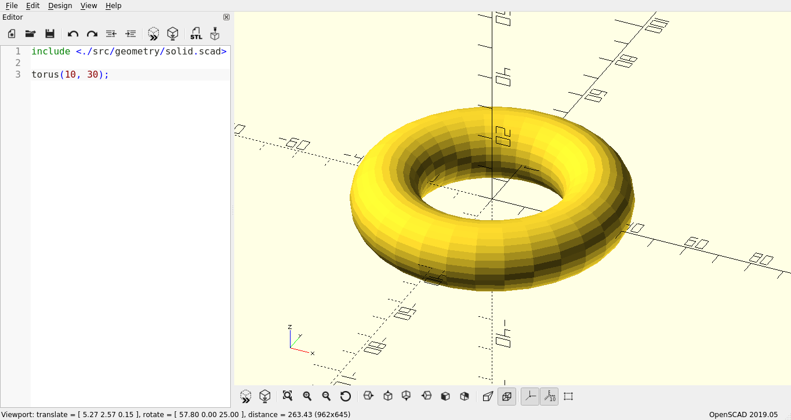

batteries -- Powers your OpenSCAD designs
=========================================

A work-in-progress standard library for OpenSCAD.

The idea is to make OpenSCAD code more legible by providing a stronger set of
primitives, and providing mathematical functions for common trig operations
that it more explicit how you derived your math.

This requires OpenSCAD version 2019.05, because of it's use of the `each` operator.

